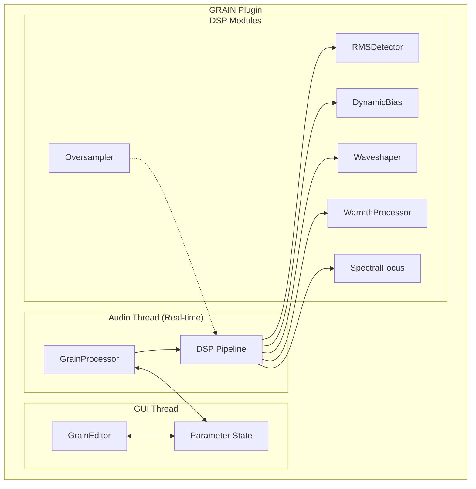
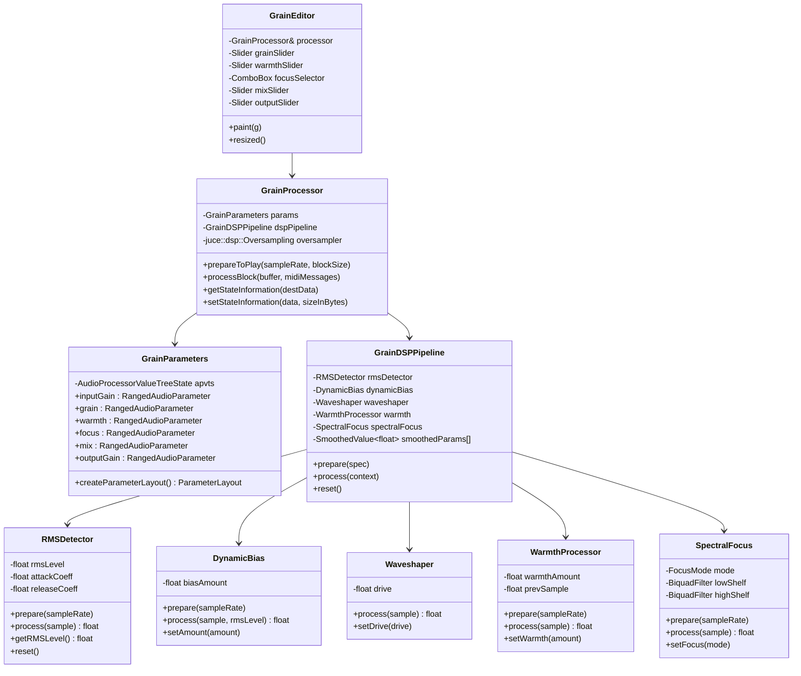
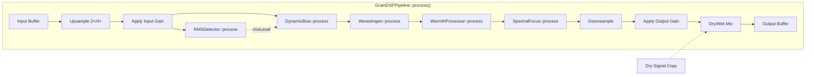
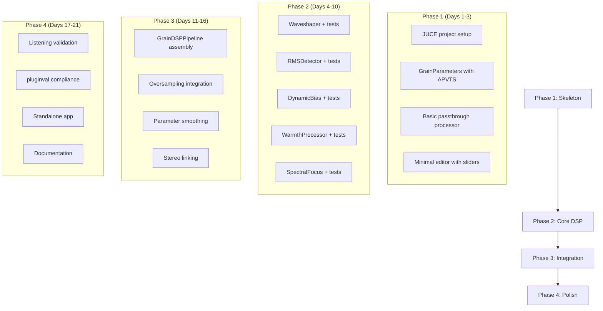

# GRAIN — Code Architecture Design
## Micro-harmonic Saturation Processor (JUCE/C++)

---

## 1. High-Level Architecture



---

## 2. Module Responsibilities

### 2.1 Core Plugin Classes (JUCE Standard)

| Class | Responsibility |
|-------|----------------|
| `GrainProcessor` | Main audio processor. Manages DSP pipeline, parameters, state save/load |
| `GrainEditor` | UI component. Binds controls to parameters |
| `GrainParameters` | Centralized parameter definitions with thread-safe access |

### 2.2 DSP Modules (Custom)

| Module | Responsibility |
|--------|----------------|
| `RMSDetector` | Slow envelope follower for level-dependent behavior |
| `DynamicBias` | Applies asymmetry based on RMS level (even harmonics) |
| `Waveshaper` | tanh-based soft saturation in near-linear zone |
| `WarmthProcessor` | Subtle even/odd harmonic balance |
| `SpectralFocus` | Gentle Low/Mid/High spectral bias |
| `Oversampler` | 2×/4× oversampling wrapper (uses JUCE's dsp::Oversampling) |
| `GrainDSPPipeline` | Orchestrates all modules in correct order |

---

## 3. Class Diagram



---

## 4. DSP Signal Flow (Code Level)



---

## 5. File Structure

```
GRAIN/
├── Source/
│   ├── PluginProcessor.h
│   ├── PluginProcessor.cpp
│   ├── PluginEditor.h
│   ├── PluginEditor.cpp
│   │
│   ├── Parameters/
│   │   ├── GrainParameters.h
│   │   └── GrainParameters.cpp
│   │
│   ├── DSP/
│   │   ├── GrainDSPPipeline.h
│   │   ├── GrainDSPPipeline.cpp
│   │   ├── RMSDetector.h
│   │   ├── RMSDetector.cpp
│   │   ├── DynamicBias.h
│   │   ├── DynamicBias.cpp
│   │   ├── Waveshaper.h
│   │   ├── Waveshaper.cpp
│   │   ├── WarmthProcessor.h
│   │   ├── WarmthProcessor.cpp
│   │   ├── SpectralFocus.h
│   │   └── SpectralFocus.cpp
│   │
│   └── Utils/
│       ├── Constants.h          // Default values, ranges
│       └── DSPHelpers.h         // Utility functions
│
├── Tests/
│   ├── DSP/
│   │   ├── RMSDetectorTest.cpp
│   │   ├── WaveshaperTest.cpp
│   │   ├── DynamicBiasTest.cpp
│   │   └── SpectralFocusTest.cpp
│   └── Integration/
│       └── PipelineTest.cpp
│
├── Standalone/
│   ├── Main.cpp
│   └── StandaloneApp.h
│
├── Resources/
│   └── (future: presets, images)
│
├── GRAIN.jucer                   // Projucer project file
└── CMakeLists.txt               // Optional: CMake build
```

---

## 6. Parameter Specification

```cpp
// GrainParameters.h - Parameter IDs and ranges

namespace ParamIDs {
    constexpr const char* INPUT_GAIN = "inputGain";
    constexpr const char* GRAIN      = "grain";
    constexpr const char* WARMTH     = "warmth";
    constexpr const char* FOCUS      = "focus";
    constexpr const char* MIX        = "mix";
    constexpr const char* OUTPUT     = "outputGain";
}

namespace ParamRanges {
    // Input Gain: -12dB to +12dB (limited drive)
    constexpr float INPUT_MIN = -12.0f;
    constexpr float INPUT_MAX = 12.0f;
    constexpr float INPUT_DEFAULT = 0.0f;
    
    // Grain (saturation amount): 0% to 100%
    constexpr float GRAIN_MIN = 0.0f;
    constexpr float GRAIN_MAX = 100.0f;
    constexpr float GRAIN_DEFAULT = 25.0f;
    
    // Warmth (even/odd balance): -100% to +100%
    constexpr float WARMTH_MIN = -100.0f;
    constexpr float WARMTH_MAX = 100.0f;
    constexpr float WARMTH_DEFAULT = 0.0f;
    
    // Focus: 0=Low, 1=Mid, 2=High
    constexpr int FOCUS_LOW = 0;
    constexpr int FOCUS_MID = 1;
    constexpr int FOCUS_HIGH = 2;
    constexpr int FOCUS_DEFAULT = FOCUS_MID;
    
    // Mix (dry/wet): 0% to 100%
    constexpr float MIX_MIN = 0.0f;
    constexpr float MIX_MAX = 100.0f;
    constexpr float MIX_DEFAULT = 15.0f;  // Subtle by default
    
    // Output Gain: -12dB to +12dB
    constexpr float OUTPUT_MIN = -12.0f;
    constexpr float OUTPUT_MAX = 12.0f;
    constexpr float OUTPUT_DEFAULT = 0.0f;
}
```

---

## 7. Key Implementation Details

### 7.1 RMS Detector (Slow Envelope)

```cpp
// Conceptual implementation
class RMSDetector {
public:
    void prepare(double sampleRate) {
        // Very slow time constants (100-300ms)
        float attackTimeMs = 150.0f;
        float releaseTimeMs = 300.0f;
        
        attackCoeff = std::exp(-1.0f / (sampleRate * attackTimeMs / 1000.0f));
        releaseCoeff = std::exp(-1.0f / (sampleRate * releaseTimeMs / 1000.0f));
    }
    
    float process(float sample) {
        float squaredInput = sample * sample;
        float coeff = (squaredInput > rmsSquared) ? attackCoeff : releaseCoeff;
        rmsSquared = coeff * rmsSquared + (1.0f - coeff) * squaredInput;
        return std::sqrt(rmsSquared);
    }
    
private:
    float rmsSquared = 0.0f;
    float attackCoeff, releaseCoeff;
};
```

### 7.2 Waveshaper (tanh in near-linear zone)

```cpp
// Soft saturation with controlled drive
class Waveshaper {
public:
    float process(float sample) {
        // drive maps grain parameter to small range (0.1 - 0.5)
        // to stay in near-linear tanh region
        return std::tanh(sample * drive) / std::tanh(drive);
    }
    
    void setGrain(float grainPercent) {
        // Map 0-100% to 0.1-0.5 drive range
        drive = juce::jmap(grainPercent, 0.0f, 100.0f, 0.1f, 0.5f);
    }
    
private:
    float drive = 0.25f;
};
```

### 7.3 Dynamic Bias (Level-dependent asymmetry)

```cpp
// Triode-like asymmetry based on RMS level
class DynamicBias {
public:
    float process(float sample, float rmsLevel) {
        // Small bias proportional to RMS (promotes even harmonics)
        float bias = rmsLevel * biasAmount * 0.1f;  // Very subtle
        return sample + bias * sample * sample;     // Quadratic term
    }
    
    void setAmount(float amount) {
        biasAmount = amount;
    }
    
private:
    float biasAmount = 0.0f;
};
```

### 7.4 Oversampling Integration

```cpp
// In GrainProcessor::prepareToPlay()
void prepareToPlay(double sampleRate, int samplesPerBlock) {
    // 2× for real-time (index 1), 4× for offline (index 2)
    int oversamplingFactor = isNonRealtime() ? 2 : 1;
    
    oversampler = std::make_unique<juce::dsp::Oversampling<float>>(
        2,                              // stereo
        oversamplingFactor,             // 2^factor (2× or 4×)
        juce::dsp::Oversampling<float>::filterHalfBandPolyphaseIIR,
        true                            // max quality
    );
    
    oversampler->initProcessing(samplesPerBlock);
    
    // Prepare DSP at oversampled rate
    dspPipeline.prepare({
        sampleRate * oversampler->getOversamplingFactor(),
        static_cast<uint32>(samplesPerBlock * oversampler->getOversamplingFactor()),
        2
    });
}
```

### 7.5 Thread-Safe Parameter Smoothing

```cpp
// In GrainDSPPipeline
class GrainDSPPipeline {
public:
    void prepare(const juce::dsp::ProcessSpec& spec) {
        // Smooth over ~20ms to avoid zipper noise
        double smoothTimeSeconds = 0.02;
        
        smoothedGrain.reset(spec.sampleRate, smoothTimeSeconds);
        smoothedWarmth.reset(spec.sampleRate, smoothTimeSeconds);
        smoothedMix.reset(spec.sampleRate, smoothTimeSeconds);
        // ... etc
    }
    
    void updateParameters(float grain, float warmth, float mix /* ... */) {
        smoothedGrain.setTargetValue(grain);
        smoothedWarmth.setTargetValue(warmth);
        smoothedMix.setTargetValue(mix);
    }
    
    void processSample(float& left, float& right) {
        // Get smoothed values (advances smoother by 1 sample)
        float currentGrain = smoothedGrain.getNextValue();
        float currentWarmth = smoothedWarmth.getNextValue();
        float currentMix = smoothedMix.getNextValue();
        
        // Process with current smoothed values...
    }
    
private:
    juce::SmoothedValue<float> smoothedGrain;
    juce::SmoothedValue<float> smoothedWarmth;
    juce::SmoothedValue<float> smoothedMix;
};
```

---

## 8. Testing Strategy

### 8.1 Unit Tests (per DSP module)

| Test | What to verify |
|------|----------------|
| `RMSDetectorTest` | Correct envelope for known input (sine, silence) |
| `WaveshaperTest` | Output bounded, symmetric for symmetric input |
| `DynamicBiasTest` | Even harmonic presence, no DC offset accumulation |
| `SpectralFocusTest` | Frequency response matches Low/Mid/High modes |
| `WarmthProcessorTest` | Subtle spectral shift, no instability |

### 8.2 Integration Tests

| Test | What to verify |
|------|----------------|
| `PipelineTest` | Full chain: silence in → silence out |
| `PipelineTest` | Sine wave: output level ≈ input level at low settings |
| `PipelineTest` | Mix at 0%: output == input (bit-exact dry) |
| `PipelineTest` | No NaN/Inf on edge cases |

### 8.3 Validation (pluginval + manual)

```bash
# Automated VST3 compliance
pluginval --strictness-level 10 ./build/GRAIN.vst3

# Manual listening tests per validation plan
```

---

## 9. Implementation Order (Recommended)



---

## 10. JUCE-Specific Notes for Ruby Developers

| Ruby Concept | C++/JUCE Equivalent |
|--------------|---------------------|
| `attr_accessor` | Public member + getter/setter methods |
| Duck typing | Templates or `juce::var` for dynamic types |
| Blocks/Procs | Lambdas: `[&](float x) { return x * 2; }` |
| `nil` | `nullptr` for pointers, `std::optional` for values |
| Garbage collection | RAII + `std::unique_ptr` / `std::shared_ptr` |
| Mixins | Multiple inheritance or composition |
| `initialize` | Constructor: `ClassName() { }` |

### Memory Management Pattern

```cpp
// JUCE uses RAII extensively
class GrainProcessor {
    // Automatic cleanup when GrainProcessor is destroyed
    std::unique_ptr<GrainDSPPipeline> dspPipeline;
    
    GrainProcessor() {
        dspPipeline = std::make_unique<GrainDSPPipeline>();
    }
    // No explicit destructor needed - unique_ptr handles it
};
```

---

## 11. Quick Reference: Key JUCE Classes

| Class | Purpose |
|-------|---------|
| `AudioProcessor` | Base class for plugin processor |
| `AudioProcessorEditor` | Base class for plugin UI |
| `AudioProcessorValueTreeState` | Thread-safe parameter management |
| `SmoothedValue<T>` | Interpolate parameter changes |
| `dsp::Oversampling<T>` | Built-in oversampling |
| `dsp::IIR::Filter` | Biquad filters for SpectralFocus |
| `dsp::ProcessSpec` | Sample rate, block size, channels |
| `AudioBuffer<T>` | Main audio buffer type |

---

*Document generated for GRAIN project - Master Desarrollo con IA*
