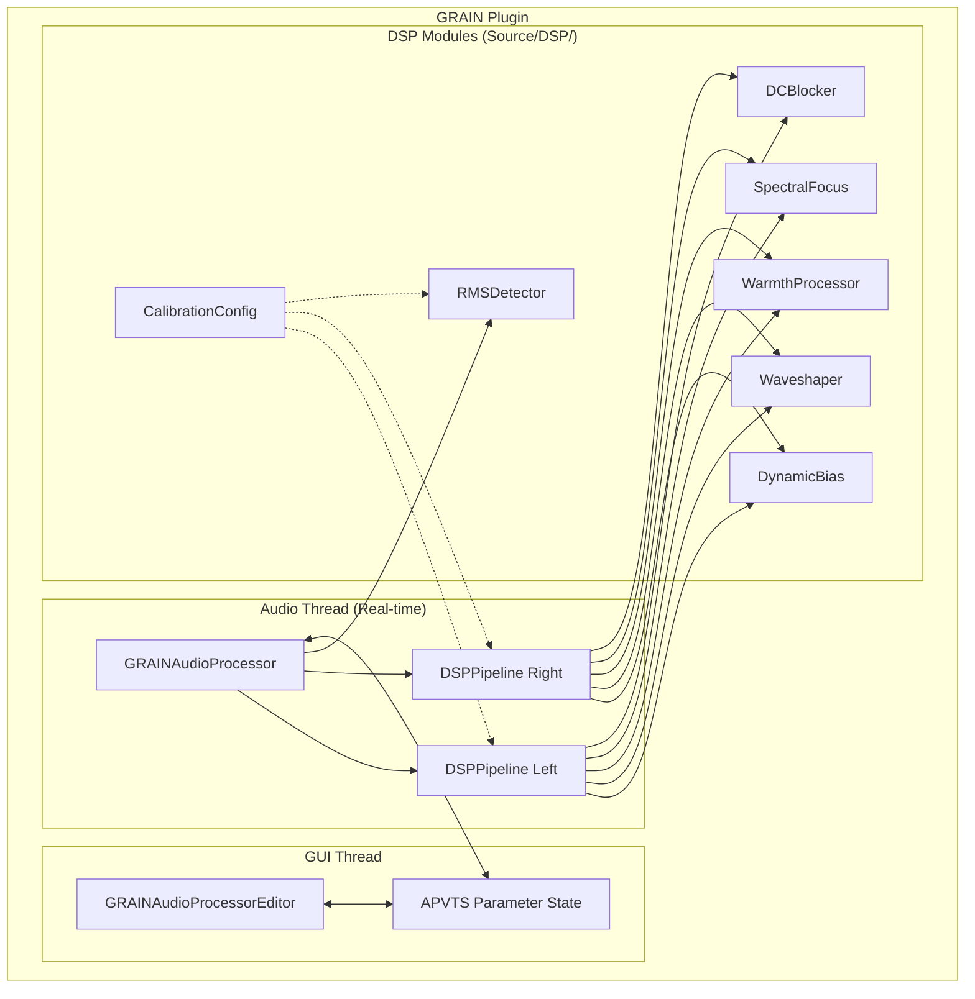
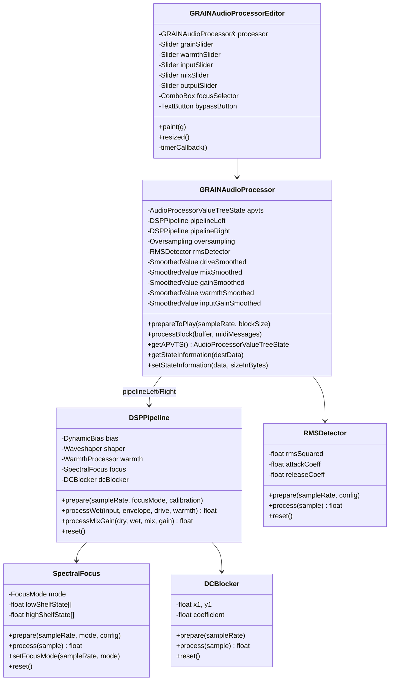
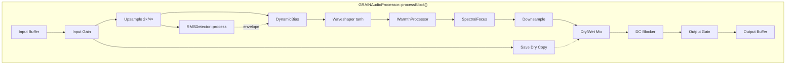
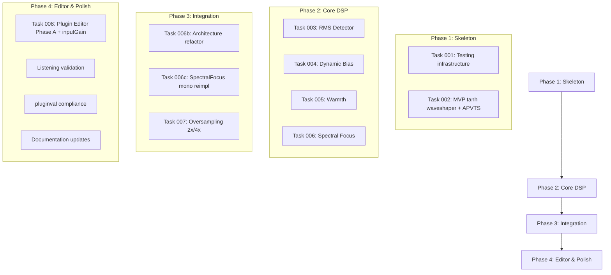

# GRAIN — Code Architecture Design
## Micro-harmonic Saturation Processor (JUCE/C++)

---

## 1. High-Level Architecture



---

## 2. Module Responsibilities

### 2.1 Core Plugin Classes (JUCE Standard)

| Class | Responsibility |
|-------|----------------|
| `GRAINAudioProcessor` | Main audio processor. Manages DSP pipeline, parameters (APVTS), state save/load |
| `GRAINAudioProcessorEditor` | UI component. Binds controls to parameters via APVTS attachments |

### 2.2 DSP Modules (Custom)

| Module | Responsibility |
|--------|----------------|
| `RMSDetector` | Slow envelope follower for level-dependent behavior |
| `DynamicBias` | Applies asymmetry based on RMS level (even harmonics) |
| `Waveshaper` | tanh-based soft saturation in near-linear zone |
| `WarmthProcessor` | Subtle even/odd harmonic balance |
| `SpectralFocus` | Gentle Low/Mid/High spectral bias |
| `CalibrationConfig` | Centralized DSP calibration constants |
| `GrainDSPPipeline` | Orchestrates all modules in correct order (per-channel mono pipeline) |

---

## 3. Class Diagram



---

## 4. DSP Signal Flow (Code Level)



---

## 5. File Structure

```
GRAIN/
├── Source/
│   ├── PluginProcessor.h        # Main audio processor (APVTS, oversampling, DSP orchestration)
│   ├── PluginProcessor.cpp
│   ├── PluginEditor.h           # GUI (Phase A — functional layout + GrainColours)
│   ├── PluginEditor.cpp
│   │
│   ├── DSP/                     # All DSP modules (header-only)
│   │   ├── CalibrationConfig.h  # Centralized calibration constants
│   │   ├── DSPHelpers.h         # Pure utility functions (calculateCoefficient, applyMix, applyGain)
│   │   ├── RMSDetector.h        # RMS envelope follower (stateful, mono)
│   │   ├── DynamicBias.h        # Asymmetric bias function (pure)
│   │   ├── Waveshaper.h         # tanh waveshaper (pure)
│   │   ├── WarmthProcessor.h    # Warmth/asymmetry function (pure)
│   │   ├── DCBlocker.h          # DC blocking filter (stateful, mono)
│   │   ├── SpectralFocus.h      # Biquad shelf EQ (stateful, mono)
│   │   └── GrainDSPPipeline.h   # Per-channel DSP pipeline orchestrator
│   │
│   └── Tests/                   # Unit & integration tests (separate GRAINTests.jucer target)
│       ├── TestMain.cpp         # Console app entry point
│       ├── DSPTests.cpp         # Unit tests (per-module)
│       ├── PipelineTest.cpp     # Integration tests (full pipeline)
│       ├── OversamplingTest.cpp # Oversampling unit tests
│       └── CalibrationTest.cpp  # CalibrationConfig unit tests
│
├── scripts/
│   ├── format.sh                # clang-format wrapper
│   └── run_tests.sh             # Build & run all unit tests (CI-friendly)
│
├── GRAIN.jucer                  # Projucer project (VST3 + Standalone)
├── GRAINTests.jucer             # Projucer project (ConsoleApp test runner)
└── CLAUDE.md                    # AI context file
```

---

## 6. Parameter Specification

Parameters are defined directly in `GRAINAudioProcessor::createParameterLayout()` using JUCE's APVTS system. No separate `GrainParameters` class exists — the processor owns the APVTS (private, accessed via `getAPVTS()`).

| ID | Name | Type | Range | Default | Notes |
|----|------|------|-------|---------|-------|
| `drive` | Drive | Float | 0.0–1.0 (step 0.01) | 0.5 | Maps to saturation intensity (UI label: "GRAIN") |
| `mix` | Mix | Float | 0.0–1.0 (step 0.01) | 0.2 | Dry/wet blend |
| `output` | Output | Float | -12.0–+12.0 dB (step 0.1) | 0.0 | Final output trim |
| `bypass` | Bypass | Bool | true/false | false | Soft bypass via mix → 0 smoothing |
| `warmth` | Warmth | Float | 0.0–1.0 (step 0.01) | 0.0 | Even harmonic asymmetry |
| `inputGain` | Input Gain | Float | -12.0–+12.0 dB (step 0.1) | 0.0 | Pre-saturation level trim |
| `focus` | Focus | Choice | Low/Mid/High | Mid (index 1) | Spectral emphasis shelf EQ |

---

## 7. Key Implementation Details

### 7.1 RMS Detector (Slow Envelope)

Location: `Source/DSP/RMSDetector.h` — stateful struct, one instance shared across channels (mono-summed).

```cpp
// GrainDSP::RMSDetector (actual implementation)
struct RMSDetector {
    float envelope = 0.0f;
    float attackCoeff = 0.0f;
    float releaseCoeff = 0.0f;

    void prepare(float sampleRate, const RMSCalibration& cal) {
        attackCoeff = calculateCoefficient(sampleRate, cal.attackMs);
        releaseCoeff = calculateCoefficient(sampleRate, cal.releaseMs);
    }

    float process(float input) {
        const float inputSquared = input * input;
        const float coeff = (inputSquared > envelope) ? attackCoeff : releaseCoeff;
        envelope = (envelope * coeff) + (inputSquared * (1.0f - coeff));
        return std::sqrt(envelope);
    }
};
```

Time constants configured via `CalibrationConfig` (default: 150ms attack, 300ms release).

### 7.2 Waveshaper (tanh with linear drive mapping)

Location: `Source/DSP/Waveshaper.h` — pure inline function (stateless).

```cpp
// GrainDSP::applyWaveshaper (actual implementation)
inline float applyWaveshaper(float input, float drive) {
    const float gained = input * (1.0f + drive * 3.0f);  // 1x to 4x gain
    return std::tanh(gained);
}
```

Drive is normalized 0.0–1.0 (from the `drive` parameter), mapped to 1x–4x pre-tanh gain.

### 7.3 Dynamic Bias (Level-dependent asymmetry)

Location: `Source/DSP/DynamicBias.h` — pure inline function (stateless).

```cpp
// GrainDSP::applyDynamicBias (actual implementation)
inline float applyDynamicBias(float input, float rmsLevel, float biasAmount,
                               const BiasCalibration& cal) {
    const float bias = rmsLevel * biasAmount * cal.scale;
    return input + (bias * input * input);  // Quadratic term for even harmonics
}
```

Bias amount comes from `CalibrationConfig` (fixed at calibration time, not a user parameter).

### 7.4 Oversampling Integration

Location: `Source/PluginProcessor.cpp` — `prepareToPlay()`.

```cpp
// GRAINAudioProcessor::prepareToPlay() (simplified from actual)
currentOversamplingOrder = isNonRealtime() ? 2 : 1;  // 2^1=2x, 2^2=4x

oversampling = std::make_unique<juce::dsp::Oversampling<float>>(
    static_cast<size_t>(getTotalNumInputChannels()),
    currentOversamplingOrder,
    juce::dsp::Oversampling<float>::filterHalfBandPolyphaseIIR, true);

oversampling->initProcessing(static_cast<size_t>(samplesPerBlock));
setLatencySamples(static_cast<int>(oversampling->getLatencyInSamples()));

const double oversampledRate = sampleRate *
    static_cast<double>(oversampling->getOversamplingFactor());

// Per-channel pipelines prepared at oversampled rate
pipelineLeft.prepare(static_cast<float>(oversampledRate), focusMode, calibration);
pipelineRight.prepare(static_cast<float>(oversampledRate), focusMode, calibration);
```

### 7.5 Per-Channel DSP Pipeline

Location: `Source/DSP/GrainDSPPipeline.h` — mono struct, two instances (L/R) for stereo.

```cpp
// GrainDSP::DSPPipeline (simplified from actual)
struct DSPPipeline {
    DCBlocker dcBlocker;
    SpectralFocus spectralFocus;

    // Nonlinear stages (run at oversampled rate)
    float processWet(float input, float envelope, float drive, float warmth) {
        const float biased = applyDynamicBias(input, envelope, config.bias.amount, config.bias);
        const float shaped  = applyWaveshaper(biased, drive);
        const float warmed  = applyWarmth(shaped, warmth, config.warmth);
        return spectralFocus.process(warmed);
    }

    // Linear stages (run at original rate)
    float processMixGain(float dry, float wet, float mix, float gain) {
        const float mixed     = applyMix(dry, wet, mix);
        const float dcBlocked = dcBlocker.process(mixed);
        return applyGain(dcBlocked, gain);
    }
};
```

Parameter smoothing (`SmoothedValue`) lives in `GRAINAudioProcessor`, not in the pipeline.
Drive/warmth are smoothed at oversampled rate; mix/gain/inputGain at original rate. All smoothers use 20ms ramp time.

---

## 8. Testing Strategy

Tests run via a separate console application (`GRAINTests.jucer`). See `docs/TESTING.md` for full details.

### 8.1 Unit Tests — `Source/Tests/DSPTests.cpp` (47 tests)

| Category | What it verifies |
|----------|-----------------|
| Waveshaper (4) | Zero passthrough, symmetry, bounded output, near-linear for small values |
| Mix (3) | Full dry, full wet, 50/50 blend |
| Gain (3) | Unity, double (+6dB), zero (silence) |
| Bypass (2) | Mix=0 returns dry, full processing when mix>0 |
| Buffer (2) | Stability with constant input, no state leak |
| Parameter change (1) | No discontinuities on silent input |
| RMS Detector (7) | Coefficient calc, zero input, DC convergence, sine RMS, non-negative, slow transients, reset |
| Dynamic Bias (6) | Zero RMS, zero amount, positive/negative asymmetry, even harmonics, scaling, bounded |
| DC Blocker (3) | Passes AC, removes DC, reset clears state |
| DC Offset (1) | Bias + DC blocker pipeline near-zero mean |
| Warmth (6) | Zero warmth, zero input, bounded, asymmetry, continuous, buffer stability |
| Focus (6) | Mid unity, reset, silence, Low boost, High boost, mono independence, no NaN/Inf |

### 8.2 Integration & Other Tests

| File | Tests | What it verifies |
|------|-------|-----------------|
| `PipelineTest.cpp` | 4 | Silence→silence, mix=0 dry, no NaN/Inf, level match at low settings |
| `OversamplingTest.cpp` | 5 | Silence, 2x/4x block sizes, latency bounds, signal passthrough |
| `CalibrationTest.cpp` | 3 | Default matches constants, extreme no NaN/Inf, different configs differ |

**Total: 59 tests**

### 8.3 Validation (pluginval + manual)

```bash
# Automated VST3 compliance (use app bundle path)
/Applications/pluginval.app/Contents/MacOS/pluginval \
  --skip-gui-tests --validate ~/Library/Audio/Plug-Ins/VST3/GRAIN.vst3

# Strict validation (before release)
/Applications/pluginval.app/Contents/MacOS/pluginval \
  --skip-gui-tests --strictness-level 10 --validate ~/Library/Audio/Plug-Ins/VST3/GRAIN.vst3
```

---

## 9. Implementation Order (Actual)



All phases through Phase 4 are complete. See `CLAUDE.md` Task Files table for full status.

---

## 10. C++/JUCE Quick Reference

| C++ Concept | JUCE Usage in GRAIN |
|-------------|---------------------|
| Lambdas | Used in meter drawing: `auto drawLevel = [&](rect, level) { ... }` |
| RAII | `std::unique_ptr<Oversampling>` auto-cleans on destruction |
| `std::atomic` | Level meters: `inputLevelL.store()` / `.load()` for thread-safe GUI reads |
| Templates | `SmoothedValue<float>`, `AudioBuffer<float>`, `Oversampling<float>` |
| Inline functions | All stateless DSP modules (`applyWaveshaper`, `applyDynamicBias`, etc.) |
| Structs | DSP modules use `struct` (public by default) for data + methods |

### Memory Management Pattern

```cpp
// GRAIN uses RAII — unique_ptr for dynamic allocations
class GRAINAudioProcessor {
    std::unique_ptr<juce::dsp::Oversampling<float>> oversampling;

    void prepareToPlay(double sampleRate, int samplesPerBlock) {
        oversampling = std::make_unique<juce::dsp::Oversampling<float>>(...);
        // Automatically freed when processor is destroyed or re-prepared
    }
};
```

---

## 11. Quick Reference: Key JUCE Classes

| Class | Purpose |
|-------|---------|
| `AudioProcessor` | Base class for plugin processor |
| `AudioProcessorEditor` | Base class for plugin UI |
| `AudioProcessorValueTreeState` | Thread-safe parameter management |
| `SmoothedValue<T>` | Interpolate parameter changes |
| `dsp::Oversampling<T>` | Built-in oversampling |
| `dsp::IIR::Filter` | Biquad filters for SpectralFocus |
| `dsp::ProcessSpec` | Sample rate, block size, channels |
| `AudioBuffer<T>` | Main audio buffer type |

---

*Document generated for GRAIN project - Master Desarrollo con IA*
